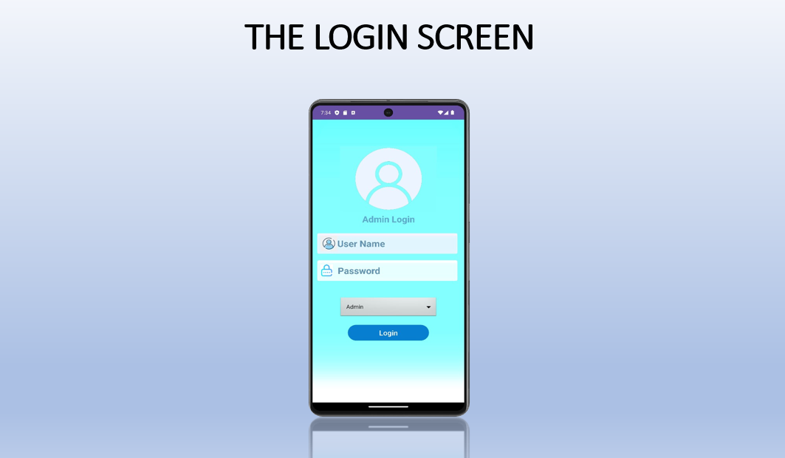
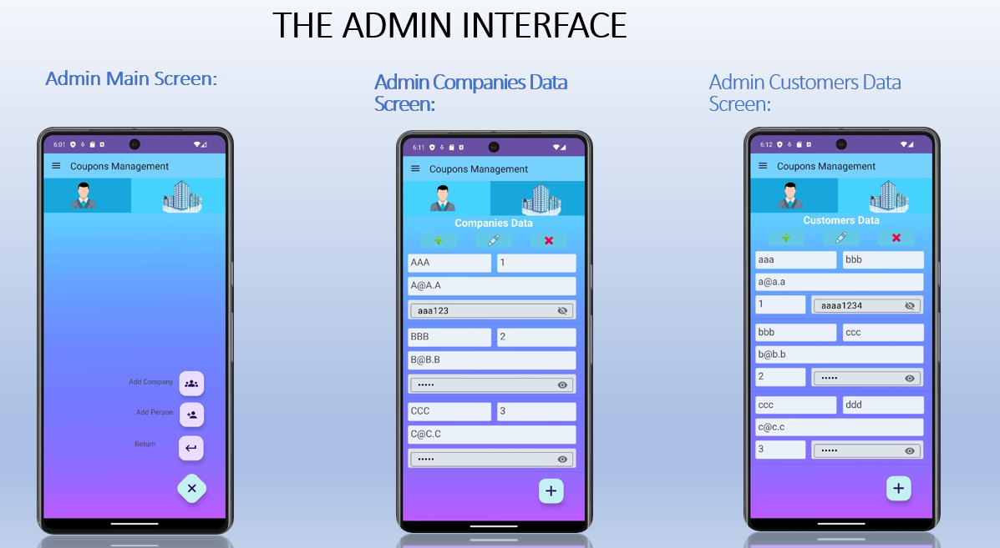
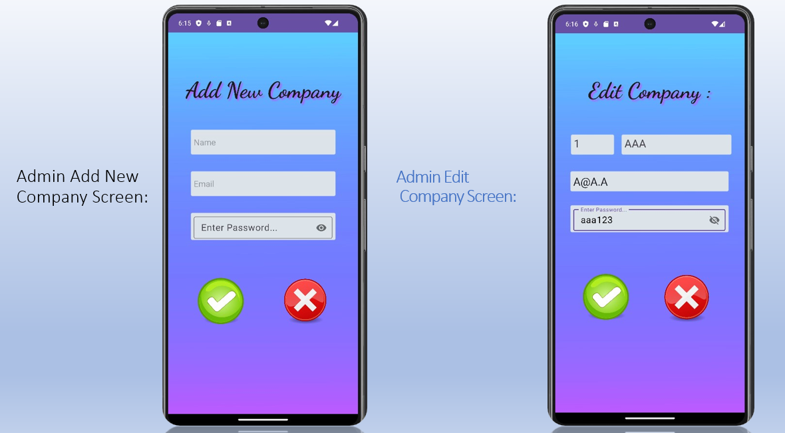
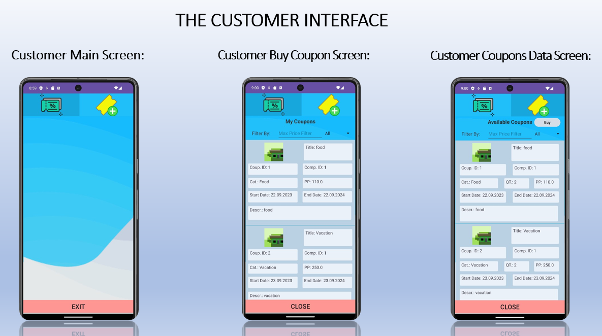
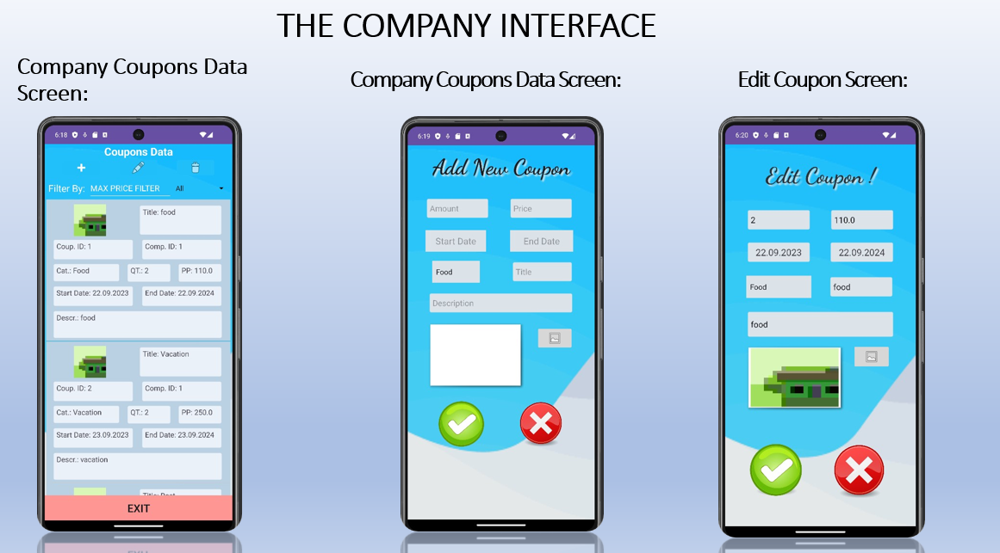

# CouponManagementAPP

Project in collaboration with Kendoo: build an Android application that manages coupons, with three types of clients: user, admin and company , each one having its own permission such as adding/deleting/updating a coupon and a lot more!

## Project Development Stages

### Initial Stage

In the initial stage of the project, we carefully considered the approach to successfully complete it. We started by reviewing the material learned during the course to utilize these tools during the project work.

### Planning Stage

Next, we reviewed the project requirements and created a framework document with goals, main tasks, and a schedule. Once we knew our direction, we began to execute the tasks consistently, maintaining accurate and high-quality results. This approach contributed to the project's success and achieving the desired outcomes.

### Project Management

It's also important to note that we decided to manage the entire work on GitHub, as it simplifies the workflow significantly.

## Focus Areas

Which components did we emphasize the most, and which less? Initially, we had to ensure that our application worked correctly, so we prioritized functionality. This included ensuring the system operated properly, data entered tables correctly, and all components synchronized with each other.

### Design and Functionality

The initial design was not impressive, but that was the direction we aimed to advance. Once we were confident the application worked as expected, we began to improve and design the interface to be modern and attractive.

## Application pictures:

### Overall Project Experience

Initially, we had to ensure our application functioned correctly. Therefore, we prioritized functionality work, ensuring the system operated properly, data entered tables correctly, and all parts were synchronized. The initial design was not impressive, but it was the direction we aimed to advance. Once we were confident the application worked as expected, we began to improve and design the interface to be modern and attractive.

## Note

The app is currently not available for download. However, if you are interested, please feel free to contact me at: mhmdhuss44@gmail.com .

